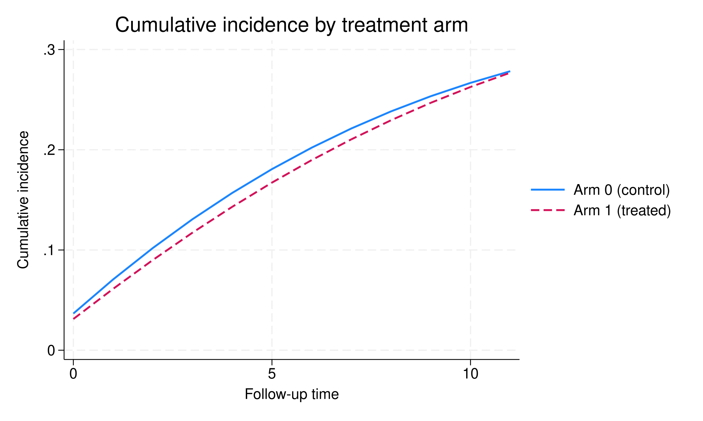

```{r, include=FALSE}
library(Statamarkdown)
```

```{stata, include=FALSE, collectcode=TRUE}
adopath ++ ..
```

Generate a synthetic person-period dataset; `id` individual identifier, `time`
calendar period, `treatment` binary treatment indicator, `outcome` equal to 1
only in the period the event first occurs, `age` a baseline covariate, and `bmi`
a time-varying confounder.

```{stata, collectcode=TRUE, results='hide'}
clear
set seed 42
set obs 500
gen id = _n
gen age = rnormal(50, 10)
expand 12
bysort id (age): gen time = _n - 1
gen bmi = .
bysort id (time): replace bmi = rnormal(25, 4) if time == 0
bysort id (time): replace bmi = bmi[_n-1] + rnormal(0, 1) if time > 0
gen treatment = .
bysort id (time): replace treatment = ///
    (runiform() < invlogit(-2 + 0.1 * (bmi - 25))) if time == 0
bysort id (time): replace treatment = ///
    cond(treatment[_n-1] == 0, ///
         runiform() < invlogit(-2 + 0.1 * (bmi - 25)), ///
         runiform() < 0.7) if time > 0
gen outcome = (runiform() < invlogit(-3 + 0.05 * (bmi - 25) - 0.4 * treatment))
bysort id (time): gen cumev = sum(outcome)
drop if cumev > 1
drop cumev
sort id time
```

ITT estimator.

```{stata}
seqtte outcome, id(id) time(time) treatment(treatment) covariates(age)
```

Unweighted PP estimator (censoring applied, no IPCW weights).

```{stata}
seqtte outcome, id(id) time(time) treatment(treatment) covariates(age) ///
    estimator(pp)
```

PP estimator with unstabilized weights.

```{stata}
seqtte outcome, id(id) time(time) treatment(treatment) covariates(age) ///
    estimator(pp) wdenominator(age bmi)
```

PP estimator with stabilized weights. The numerator model contains the baseline
covariate only; the denominator model additionally contains the time-varying
confounder. (If the numerator and denominator models are given the same
covariates the two models coincide, every weight is 1, and the fit is identical
to the unweighted per-protocol analysis.)

```{stata}
seqtte outcome, id(id) time(time) treatment(treatment) covariates(age) ///
    estimator(pp) wdenominator(age bmi) wnumerator(age)
```

Cumulative incidence curves for each treatment arm with the `plot` option.

```{stata, results=FALSE}
seqtte outcome, id(id) time(time) treatment(treatment) covariates(age) plot
qui graph export ./img/seqtte-plot-01.svg, name(seqtte_cif) replace
```

```{r, echo=FALSE, fig.align='center', fig.alt="Cumulative incidence curves by treatment arm."}

```

Bootstrap standard error and percentile confidence interval.

```{stata}
seqtte outcome, id(id) time(time) treatment(treatment) covariates(age) ///
    bootstrap(250) seed(12345)
```

Perform the data expansion only, leaving the expanded dataset in memory for
inspection or for fitting your own outcome model.

```{stata}
seqtte outcome, id(id) time(time) treatment(treatment) expandonly
```

```{stata}
describe
```
